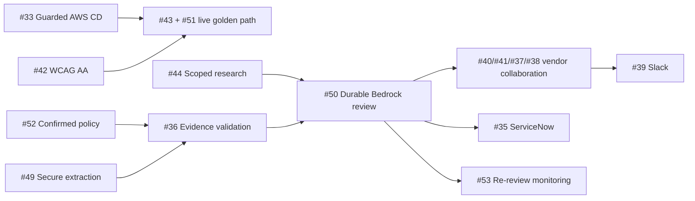
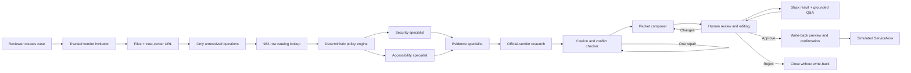

# Three-Day Implementation Plan

This is the execution plan for the requirements in [`docs/PRD.md`](docs/PRD.md). The schedule assumes intensive use of frontier coding agents with one human integration owner.

## July 15 CSUB validation and completion plan

The July 15 end-user review validated the product direction and exposed the
remaining gap between a polished reviewer demo and a dependable vendor-to-
decision product. The reviewer foundation from PR #16 is the baseline. Work is
complete only after it is merged, deployed, and exercised through the live
CloudFront/API path; opening a pull request or passing a fixture test is not a
release gate.

CSUB confirmed these workflow priorities:

- ServiceNow initiates the request and remains the intended status/system of
  record; the prototype keeps the contract-faithful mock until sandbox access
  exists.
- The largest operational cost is repeatedly chasing vendors for missing,
  invalid, or stale evidence.
- Vendors need a resumable workspace that says what was received, what is still
  missing or invalid, which stage the review is in, and how to ask a question.
- Evidence labels are insufficient: the system must inspect document contents,
  dates, product identity, and required coverage before crediting a criterion.
- Security and accessibility remain equal review tracks. Risk and approval are
  product-, use-case-, evidence-, and profile-version-specific.
- Vendor research stays on the official vendor domain or explicitly configured
  standards sources and retains claim-level provenance.
- Slack is the first notification surface. Approval and other mutations remain
  in VETTED.

### Dependency-ordered merge and delivery train

| Gate | Issues | Deliverable | Exit condition |
|---|---|---|---|
| 0. Safe delivery and live golden path | #33, #43, #42, #51 | Guarded AWS CD, reliable tokenized invitations, WCAG AA remediation, and three live scenarios | `main` deploys automatically; rollback is proven; all three scenarios pass through live APIs in the Codex in-app browser |
| 1. Trusted evidence and policy foundation | #49, #44, #52, #36 | Real evidence-byte ingestion, official-domain research, partner-confirmed policy versions, and content/date validation | Sanitized PDF/DOCX/XLSX/image evidence is extracted with source coordinates; unsafe URLs and document instructions fail closed; unknown criteria remain explicit TBDs; invalid evidence never satisfies a requirement |
| 2. Durable review intelligence | #50 | Bedrock orchestration, citation gates, recovery, and evaluations | Twelve sanitized gold cases plus adversarial cases pass; every material claim resolves; malformed output and restart/retry behavior are explicit; no silent fixture fallback |
| 3. Vendor collaboration | #40, #41, #37, #38 | Resume/revise, clarification thread, weekly reminders, status, and decision notification | Vendor state survives interruption; reminders are idempotent and auditable; vendor-safe status exposes no reviewer-only data |
| 4. External integrations and lifecycle | #39, #35, #53 | Slack sandbox, future live ServiceNow adapter, and expiring-evidence re-review | External credentials/sandboxes exist; signatures, authorization, idempotency, and audit tests pass before enabling each adapter |

Issue #52 is an external decision track that starts immediately. Unknown CSUB
criteria remain `TBD` and force review/escalation; an agent must never fill them
in. Issues #35 and #39 remain explicitly blocked until CSUB supplies the
corresponding sandbox access and authorized identities.

### Release discipline for every gate

1. Land the smallest independently useful PR; partially delivered issue
   acceptance criteria stay open and are called out in the merge comment.
2. Require a teammate approval, current `Repository checks`, CodeQL, resolved
   review threads, and the relevant focused tests.
3. Let guarded CD deploy the reviewed `main` commit using short-lived AWS OIDC
   credentials and an immutable release bundle.
4. Run live API canaries and the affected reviewer/vendor flows. Do not
   substitute fixtures for a failed live service.
5. Close the issue only after deployed acceptance evidence is attached. Roll
   back automatically when the live canary fails and open a follow-up incident.

## Delivery rules

- Lock shared schemas and interfaces before parallel implementation begins.
- Use separate branches/worktrees for independent workstreams.
- Keep institutional source files and generated artifacts outside Git.
- Every behavior change includes tests and documentation.
- Models may draft and analyze but cannot establish policy or approve/write externally.
- The vendor-to-approval golden path, human review, AWS deployment, Slack notification/Q&A, and mock ServiceNow boundaries are core demo work.
- Merge checkpoints occur Tuesday midday/EOD, Wednesday midday/EOD, and Thursday at 10:00 AM.

## Target workflow

## Shared contracts to lock first

- Case intake and validation schema.
- `SourceManifest`, `ApprovedSoftwareRecord`, `RecommendationClause`, `AssessmentAnswer`, `EvidenceRecord`, `WorkflowGraph`, and `PolicyRuleSet`.
- `ReviewGraphState` and structured specialist outputs.
- Packet and citation schemas.
- REST/OpenAPI contract from the PRD.
- `ServiceNowConnector` and mock data contract.
- Error codes, audit-event format, configuration precedence, and test fixtures.

The integration owner approves shared-contract changes after parallel work begins.

## Tuesday, July 14 — Contracts and local vertical slice

### Data and policy agent

- Create the Box source manifest and local ingestion contract.
- Parse and reconcile every approved-software workbook row and column.
- Generate lossless JSON/Parquet snapshots and normalized records.
- Extract recommendation clauses with stable IDs and source coordinates.
- Implement version-aware HECVAT normalization and extraction warnings.
- Transcribe both flowcharts and decision trees into source-linked versioned JSON.
- Create a conflict registry instead of resolving disputed thresholds.
- Implement deterministic policy evaluation and boundary tests.

### Workflow and LLM agent

- Define LangGraph state, node inputs/outputs, and checkpoint boundaries.
- Implement approved-software lookup and policy-tool adapters.
- Add parallel security and accessibility specialist nodes.
- Add evidence, scoped vendor-research, citation-checker, and packet-composer nodes.
- Enforce structured model outputs and one repair pass.
- Provide local deterministic/mock model behavior for tests.

### UI agent

- Build guided intake with required-field and data-boundary messaging.
- Show approved-software candidates, match type, score, and source row.
- Add workflow progress and security/accessibility result views.
- Build editable medium-risk packet and citation panels.
- Build review decisions and simulated write-back preview/confirmation.

### AWS and integration agent

- Establish configurable CDK application boundaries without hard-coded account details.
- Add storage, API, model, and connector interfaces with local implementations.
- Implement `MockServiceNowConnector`, synthetic records, concurrency checks, attachments, and idempotency.
- Establish CI for documentation checks, lint, type checks, tests, and secret scanning.
- Define structured audit events and local logging.

### Tuesday gate

- PRD, plan, architecture decision, and agent instructions are current.
- Source files are checksummed, classified, and excluded from Git.
- Approved-software row/column counts reconcile.
- Recommendation clauses retain source coordinates.
- Both flowcharts have verified JSON representations.
- One low-risk and one medium-risk case run locally.
- Mock ServiceNow before/after preview works.
- CI runs the available documentation and code checks.

## Wednesday, July 15 — AWS integration and full workflow

### Environment decision gate

Before provisioning, record the approved AWS account/profile, region, owner, budget, expiration, data classification, retention, and teardown path. Inspect Bedrock access and pin available model/inference-profile IDs.

### Build and integration

- Deploy KMS-encrypted S3, DynamoDB, API Gateway, Cognito, CloudFront, Knowledge Base/S3 Vectors, Guardrails, AgentCore Runtime/Memory, and monitoring.
- Add the reviewer-created vendor invitation, file-first intake, trust-center URL, adaptive question, and submission-tracking flow.
- Import all 982 catalog records while preserving explicit support/license flags and requiring human confirmation for fuzzy/semantic matches.
- Ingest and verify the approved source corpus.
- Keep campus policy and vendor evidence in distinct retrieval scopes.
- Connect the UI and API to the deployed LangGraph workflow.
- Implement durable human interrupt, edit, reject, approve, and resume.
- Complete low-risk summaries and editable medium-risk packets.
- Connect ServiceNow preview, update, work note, and attachment operations to the mock connector.
- Add deterministic read-only import from a seeded mock ServiceNow request.
- Persist versioned security/accessibility profiles and surface draft, fixture-test, activate, and rollback actions.
- Connect a real Slack sandbox for signed notifications, allowlisted case-grounded Q&A, and application deep links; keep approvals and mutations in the app.
- Create at least 12 sanitized gold cases: four low, four medium, and four high/unknown.
- Add metrics for analysis latency, model/tool failures, citations, escalation, approvals, and writes.

### Wednesday gate

- A reviewer can create a case, issue a vendor link, observe open/submission status, and receive a complete vendor evidence submission.
- The vendor sees only unresolved questions and cannot access reviewer-only data.
- Low, medium, and safe-escalation cases run end to end in AWS.
- Review can pause across a restart and resume from persisted state.
- Packet citations resolve to the correct file and source location.
- An approved decision can update and attach through the mock connector only.
- Stale and failed writes surface clearly and retry without duplication.
- Vendor evidence cannot cross case, vendor, or product boundaries.
- Slack results and Q&A are live, while approval and ServiceNow confirmation remain app-only.

## Thursday, July 16 — Hardening and demo

### Test and remediation

- Reconcile all spreadsheet counts, columns, source coordinates, and hashes.
- Test formulas, blanks, merged cells, malformed sheets, and supported HECVAT versions.
- Run risk-boundary cases, including user count, cost, data levels, AI, SSO, integrations, classroom/public use, GDPR, and PCI.
- Test missing inputs, stale evidence, vendor/product mismatches, unresolved rules, and malicious document instructions.
- Test reviewer authorization and every pause/resume/reject/approve transition.
- Test ServiceNow dry-run parity, stale version, duplicate submission, attachment failure, and 401/403/429/500 equivalents.
- Review logs for sensitive content and confirm retention, lifecycle, budget, and teardown configuration.
- Run final security scan, integration review, and health checks.

### Demo package

Prepare three deterministic demo cases:

1. An approved or clearly low-risk product with a traceable source match.
2. A medium-risk department/classroom product producing a complete editable TAAP/security packet.
3. A high-risk, incomplete, or contradictory case that safely escalates.

The demo must show citations, human edits, explicit approval, before/after simulated ServiceNow state, packet attachment, and the `Simulated ServiceNow` label.

### Stretch gate

If all core acceptance criteria pass by 10:00 AM, add in order:

1. Manually sent vendor-request email draft.
2. Extended reviewer metrics dashboard.
3. Microsoft Teams adapter.
4. Self-service institution signup and broader multi-tenant administration.

## Agentic AI boundaries

Good uses of agents:

- Choose relevant read-only evidence tools.
- Run security and accessibility analysis in parallel.
- Extract and compare evidence using document-specific prompts.
- Search the configured official vendor domain.
- Detect contradictions and product/version mismatches.
- Draft packets from approved templates and clauses.
- Evaluate citation completeness and perform one bounded repair.

Deterministic or human-only operations:

- Policy thresholds and risk calculation.
- Confirmation of fuzzy or semantic software matches.
- Cross-document authority and source precedence.
- Final reviewer decision or TAAP signature.
- ServiceNow table/field selection and write execution.
- Conflict resolution when supplied sources disagree.

## Serac integration path

- Do not make Serac a demo dependency.
- Use its ServiceNow MCP schemas only to validate connector compatibility.
- Keep `MockServiceNowConnector` as the active implementation.
- If a sandbox becomes available later, place `@serac-labs/servicenow-mcp` in an isolated sidecar behind the application connector.
- Allowlist schema discovery, record reading, restricted configured updates, and attachment upload only.
- Keep secrets in AWS Secrets Manager and separate read/write identities.
- Never expose arbitrary CRUD, deletes, scripts, deployment, user administration, or Flow Designer tools to a model.

## Coding-agent skill routing

- `amazon-bedrock`: models, Knowledge Bases, AgentCore, Guardrails, and model discovery.
- `aws-cdk`: infrastructure, validation, configuration, and teardown.
- `aws-sdk-python-usage`: Python ingestion and LangGraph AWS integrations.
- `aws-sdk-js-v3-usage`: TypeScript API and Lambda integrations.
- `spreadsheets:Spreadsheets`: workbook inspection and reconciliation.
- `pdf:pdf` and `documents:documents`: flowcharts, policies, TAAPs, and vendor evidence.
- `frontend-design`: requester and reviewer interfaces.
- `browse`/`qa`: official-vendor browsing and end-to-end testing.
- `codex-security:security-scan` and `security-diff-scan`: uploads, authentication, tool boundaries, and write-back.
- `review` and `health`: integration and release gates.
- `github:github`: Serac and dependency inspection.
- `find-skills`: only when a workstream lacks an existing trusted capability.

## Definition of done

- All PRD acceptance criteria pass or have a documented blocker.
- Documentation describes the implementation and its limitations accurately.
- No institutional files, generated packets, secrets, or unrelated changes are committed.
- CI and the most relevant local tests pass.
- The diff has received security and integration review.
- AWS resources have an owner, budget, retention policy, and teardown procedure.
- The demo is reproducible from a documented sanitized scenario.
