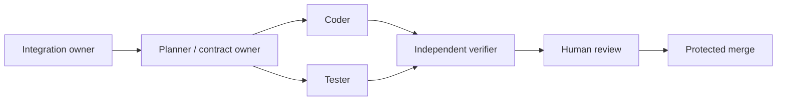

# Coding-agent workflow

## Operating model

Use agents as bounded engineering roles, not as an unstructured swarm:



AgentProp analysis of `planner_coder_tester_reviewer` selected `coder` and `tester` as the full-context seed roles and `tester` and `planner` as verifier candidates. Preserve the coder/tester context and all verifier feedback; do not prune user constraints, tool results, failed tests, or review findings to save tokens.

## Parallelization boundaries

- Reviewer web agent owns `apps/reviewer-web/`.
- Integration agent owns the mock ServiceNow adapter and `services/auth-api/`.
- Review workflow agent owns orchestration under `services/review-agent/`.
- Data/policy agent owns ingestion and deterministic policy modules under `services/review-agent/`, coordinated with the workflow owner.
- Contract owner controls `packages/contracts/`.
- Infrastructure agent owns `infra/`.
- Tester/verifier owns cross-service `tests/` and does not modify implementation merely to make a test pass without returning the finding to the owner.

Two agents must not edit the same shared file concurrently. Shared contracts, root tooling, CI, and the PRD have one integration owner.

## Task context packet

Every agent receives:

1. Objective and observable user outcome.
2. Relevant PRD requirement and ADR links.
3. In-scope and prohibited paths/actions.
4. Existing contracts and invariants.
5. Data classification and trust boundaries.
6. Acceptance criteria and exact verification commands.
7. Known assumptions, open questions, and prior failed approaches.
8. Expected handoff artifact and integration owner.

Use the GitHub `Agent task` issue form as the durable task packet. Chat instructions may clarify it but should not become the only source of truth.

## Codex and Claude Code

- Codex reads `AGENTS.md`; keep it concise and authoritative.
- Claude Code reads `CLAUDE.md`, which delegates shared rules to `AGENTS.md`.
- Give both agents the same task packet, contracts, and verification commands.
- Use separate worktrees/branches for independent tasks.
- Run focused checks during iteration and `make verify` before handoff.
- Neither agent approves or merges its own change.
- If the same failure repeats, stop, preserve the output, and change strategy instead of retrying blindly.

Generate ignored, tool-specific AgentProp briefs when useful:

```bash
make agent-briefs
```

Artifacts are written under `artifacts/agentprop/` and must not contain provider keys, secrets, or institutional data.

## Handoff and verification

The coding agent hands off:

- Changed paths and behavior.
- Assumptions and intentionally deferred work.
- Tests added and exact commands/results.
- Security, data, migration, cost, and rollback impact.
- Relevant logs, screenshots, or trace identifiers using sanitized data.

The verifier independently inspects the diff and reruns the stated commands. A self-reported pass, generated summary, or green unit test alone is insufficient for changes involving policy, retrieval isolation, authorization, write-back, infrastructure, or user data.

## Context-efficiency rules

- Send full context to the coder and tester first; selectively summarize for downstream roles.
- Reference stable repository files instead of repeatedly pasting them.
- Pass deltas plus unresolved decisions after the initial context packet.
- Preserve raw failure output and verifier conclusions.
- Stop parallel work at shared-contract changes and re-synchronize all consumers.
- Prefer several small verified PRs over one broad agent-generated change.
