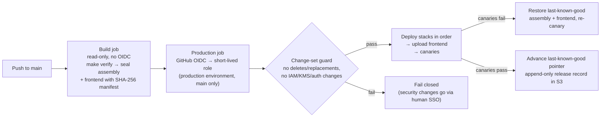
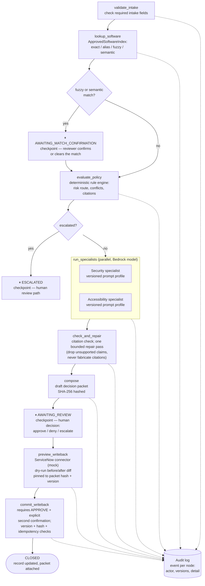

# VETTED architecture

Two views of the current system: the deployed AWS platform (`infra/lib/foundation-stack.ts` +
`infra/lib/platform-stack.ts`) and the review-agent workflow
(`services/review-agent/src/review_agent/orchestration/graph.py`).

Feature gates matter when reading the first diagram: Bedrock Guardrail, S3 Vectors /
Knowledge Bases, and all AgentCore resources are synthesized only when their
configuration flags are enabled (see `infra/DEPLOYMENT.md`). The golden demo path runs
entirely through the deterministic Case Proxy Lambda.

## AWS architecture

```mermaid
flowchart TB
    reviewer([Reviewer / Admin])
    vendor([Vendor via invite token])

    subgraph edge["Edge"]
        cf["CloudFront distribution\nOAC, TLS 1.2+, SPA fallback"]
    end

    subgraph platform["PlatformStack"]
        feBucket["S3 Frontend bucket\nprivate, SSE-S3"]
        authFn["Better Auth Lambda\nNode 22 ARM64, Function URL + OAC\n/api/auth/*"]
        cognito["Cognito ReviewerPool\nhosted UI, OTP MFA\nSPA client + confidential client"]
        secrets["Secrets Manager\nsession secret, Cognito client secret\n(own KMS key)"]

        api["API Gateway HTTP API\ncsub-case-api\nJWT authorizer on reviewer routes\nbearer invite tokens on /vendor + /intake"]
        proxy["Case Proxy Lambda\nPython 3.13 ARM64\nreview_agent.lambda_api\n+ contract-schema layer"]

        tables[("DynamoDB x10\nVendor, Product, Contact, Invite,\nSubmission, Review, Profile,\nIntegrationEvent, Audit, Idempotency\nKMS + PITR")]
        evidence[("S3 Evidence bucket\ncase-scoped presigned PUT/GET")]
        generated[("S3 Generated bucket\npackets / PDFs")]
        queue[["SQS Analysis queue + DLQ\nKMS, 6 min visibility"]]

        bedrock["Amazon Bedrock\npinned reasoning model\nInvokeModel"]

        subgraph gated["Feature-gated"]
            guardrail["Bedrock Guardrail\ncontent, prompt-attack, PII,\ncontextual grounding (pinned version)"]
            kb["S3 Vectors + Knowledge Bases\nPolicy + Evidence scopes\nembedding model"]
            agentcore["AgentCore\nRuntime + Endpoint (ECR image),\n7-day Memory, managed Browser\nCognito JWT inbound"]
            ecr["ECR csub-review-agent\nimmutable tags, scan on push"]
        end

        obs["CloudWatch\nKMS-encrypted logs, dashboard,\nalarms: API 5xx, Lambda errors,\nDLQ depth, KB ingestion"]
        trail["CloudTrail write-only\n→ S3 Audit bucket"]
        budget["AWS Budgets\n80% actual / 100% forecast alerts"]
    end

    subgraph foundation["ReviewFoundationStack"]
        kms["Customer-managed KMS data key\n(shared by reference)"]
        rawB[("S3 Raw sources")]
        normB[("S3 Normalized sources")]
        cases[("DynamoDB CasesTable")]
    end

    reviewer --> cf
    vendor --> cf
    cf --> feBucket
    cf -- "/api/auth/*" --> authFn
    authFn --> secrets
    authFn -- OIDC code exchange --> cognito
    reviewer -- SPA calls with JWT --> api
    vendor -- bearer invite token --> api
    api --> proxy

    proxy --> tables
    proxy --> cases
    proxy -- presigned uploads --> evidence
    proxy --> generated
    proxy -- enqueue analysis --> queue
    proxy -- specialist reasoning --> bedrock
    proxy -.-> guardrail
    proxy -. "InvokeAgentRuntime (gated)" .-> agentcore
    agentcore -.-> ecr
    kb -.-> evidence

    kms --- tables
    kms --- evidence
    kms --- generated
    kms --- queue
    kms --- rawB
    kms --- normB
```

Not shown for readability: the ServiceNow integration is an explicitly simulated
in-Lambda mock (its table name is configuration), and the Slack events route exists but
its secret is only imported when configured.

### Delivery path (ADR 0008)

## Review-agent workflow

`ReviewWorkflow` runs as a deterministic sequential runner with checkpoint boundaries;
the same nodes and `ReviewGraphState` are designed to bind to a LangGraph graph with an
AgentCore checkpointer. Every node emits an audit event with workflow and policy
versions.

Human-interrupt boundaries (⏸) are exactly where state checkpoints are written, so a
paused case resumes without re-running earlier nodes. Write-back is fail-closed: any
stale preview, packet hash mismatch, wrong expected record version, or missing second
confirmation raises before the connector is touched, and commits are idempotent on the
decision key.
