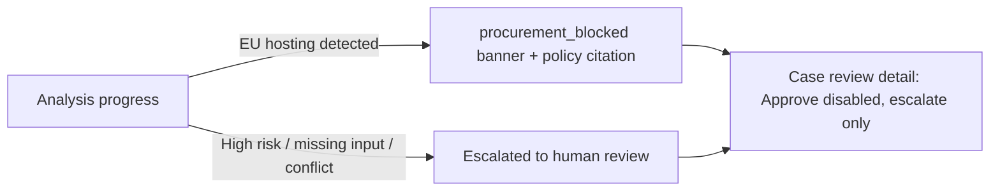
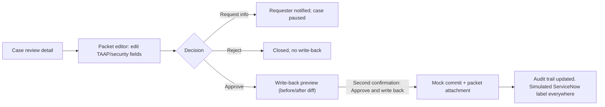
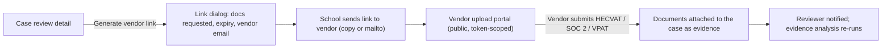

# UX/UI Plan — CSUB Technology Review Agent

## 0. Document control and how to use this document

| Field | Value |
|---|---|
| Product | CSUB Technology Review Agent |
| Audience | Tuesday "UI agent" workstream in [`../PLAN.md`](../PLAN.md) |
| Authority | Screens and interactions trace to [`PRD.md`](PRD.md) (product source of truth); build order follows [`../CLIENT-BRIEF.md`](../CLIENT-BRIEF.md) sprint priorities |
| Related | [`decisions/0001-aws-agentic-review-architecture.md`](decisions/0001-aws-agentic-review-architecture.md), [`../AGENTS.md`](../AGENTS.md) |
| Status | Approved UX/UI specification for the three-day prototype |
| Last updated | July 14, 2026 |

This document is the screen-level specification the UI workstream builds from. It covers the full PRD scope (FR-1 through FR-7), including the medium-risk packet editor and the two-step simulated ServiceNow write-back. Build order (Section 2) front-loads the CLIENT-BRIEF demo centerpiece: the low-risk fast path with one-click chair approval.

Conventions in this document follow [`../AGENTS.md`](../AGENTS.md): unresolved items are labeled **TBD**, **Assumption**, or **Open question** and collected in Section 14.

## 1. Personas and jobs to be done

**Tenancy framing:** the core customer is a **school**, not a single institution — the product is multi-school with **one school ID per account** and per-school IAM roles (Section 9). CSUB is the first and focus tenant; every screen below is written for CSUB but must render from tenant configuration (school name, policies, decision tree), never hard-coded CSUB copy. No screen may ever show another school's data.

### Requester (school staff/faculty — CSUB first)
Wants to buy software and get a fast, predictable answer. Does not know review vocabulary (HECVAT, SOC 2, Level 1 data, insurance thresholds) and must never need to. Jobs: describe the purchase in plain language, upload whatever evidence they have, see where their request stands, respond when more information is requested.

### Reviewer / Committee chair
Overloaded; most incoming volume is low-risk routine work. Jobs: see a queue of pre-vetted recommendations with citations and a document trail, confirm non-exact software matches, edit medium-risk packets, decide (approve / reject / request info) with minimal clicks, and — after an approved decision — run the clearly labeled simulated ServiceNow write-back. The human decision is the centerpiece: the AI recommends, the human decides.

### Vendor contact (external, unauthenticated)
Receives a **school-generated, case-scoped link** by email and uses it to submit security-review documentation (HECVAT, SOC 2, VPAT, insurance certificates) for their product. Has no account, sees nothing but the one upload page for the one request, and must understand in one glance who is asking, for which product, what is needed, and by when.

### Administrator / integration owner
Configures policy versions, connector mappings, school/tenant IAM roles, and AWS settings **outside this UI** (configuration files/environment). The UI exposes no admin surface in the prototype; this persona is listed only so screens never imply requesters or models can change configuration.

## 2. Scope and build order

All screens below are in scope for the sprint. Build in two passes so the demo spine is never at risk:

| Pass | Screens | Why first/second |
|---|---|---|
| **P0 — demo spine (build and polish first)** | Landing, Auth, App shell + sidebar, Dashboard, Guided intake, Analysis progress (streaming), Requester case status, Review queue, Case review detail with decision bar | CLIENT-BRIEF locked scope: low-risk fast path plus one-click chair approval |
| **P1 — full-PRD surfaces (build to "works and is honest")** | Evidence upload, Approved-software match confirmation, Medium-risk packet editor, Simulated ServiceNow write-back (preview + commit), Audit trail tab, Vendor review link (generate + vendor upload portal) | Required by PLAN.md Tuesday UI items and PRD FR-2/FR-6/FR-7; vendor links promoted from PLAN.md stretch item 1 by product-owner direction; the Thursday demo shows them |

**Scope drift note (per [`../AGENTS.md`](../AGENTS.md)):** CLIENT-BRIEF v2 listed vendor-initiated document submission as out of scope, and PLAN.md held the case-scoped vendor upload link as stretch item 1. The product owner has since pulled **school-generated vendor review links** into scope (Sections 5.15–5.16), and expanded the product framing to **multi-school tenancy** (Section 9). Both changes should be reflected back into the PRD/CLIENT-BRIEF at the next document sync and flagged to the sponsor.

**Reconciling "one-click approve" with the "two-step confirmation":** these are different gates, not a contradiction. One-click approve records the `HumanDecision` (approve/reject/request-info) on a case — the CLIENT-BRIEF centerpiece. The two-step "Approve and write back" confirmation applies only to the separate, simulated ServiceNow write-back flow (PRD FR-7), which is entered **after** a recorded approval. The demo narrative can stop at the one-click decision or continue into the simulated write-back; one UI satisfies both documents.

**Degradation fallback (pre-agreed so the Tuesday gate decision is easy):** if the packet editor slips, ship it read-only with the decision bar still functional; if streaming slips, ship polling only. Neither fallback blocks the P0 demo spine.

## 3. Information architecture

### App shell

A single React/Vite/TypeScript SPA behind auth, with:

- **Sidebar** (shadcn/ui `sidebar`, collapsible to icons): school name/logo at top (from tenant config — CSUB for the demo), primary navigation, role-filtered. **TBD:** visual treatment of the sidebar and dashboard follows the prior-project dashboard the team is supplying as design inspiration; adopt its layout/density conventions once shared, keeping the tokens in Section 7.
- **Top bar**: page title/breadcrumb, global `Prototype — Simulated ServiceNow` badge, user menu (name, role, school, sign out).
- **Content area**: routed page.
- **Toaster** (sonner): global success/failure notifications.

### Sidebar navigation by role

| Item | Requester | Reviewer | Route |
|---|---|---|---|
| Dashboard | ✓ | ✓ | `/dashboard` |
| New request | ✓ | — | `/requests/new` |
| My requests | ✓ | — | `/requests` |
| Review queue | — | ✓ | `/review` |
| All cases | — | ✓ | `/cases` |
| Vendor links | — | ✓ | `/vendor-links` |

### Routes table

| Route | Screen (Section 5) | Role | Auth |
|---|---|---|---|
| `/` | 5.1 Landing | Public | No |
| `/auth/callback`, `/auth/signed-out` | 5.2 Auth screens | Public | No |
| `/dashboard` | 5.4 Dashboard | Both | Yes |
| `/requests/new` | 5.5 Guided intake wizard | Requester | Yes |
| `/requests/:id/evidence` | 5.6 Evidence upload | Requester | Yes |
| `/requests/:id/match` | 5.7 Match confirmation | Reviewer (requester read-only) | Yes |
| `/requests/:id/analysis` | 5.8 Analysis progress (streaming) | Both | Yes |
| `/requests/:id` | 5.9 Requester case status | Requester | Yes |
| `/review` | 5.10 Review queue | Reviewer | Yes |
| `/review/:id` | 5.11 Case review detail (tabs: Recommendation, Packet, Documents, Audit) | Reviewer | Yes |
| `/review/:id/packet` | 5.12 Medium-risk packet editor (tab of 5.11) | Reviewer | Yes |
| `/review/:id/writeback` | 5.13 Simulated ServiceNow write-back | Reviewer | Yes |
| `/vendor-links` | 5.15 Vendor link management | Reviewer | Yes |
| `/vendor/:token` | 5.16 Vendor upload portal | Public (token-scoped) | No |
| `*` | 404 with link back to dashboard | Both | — |

## 4. User flows

### 4.1 Low-risk fast path (P0 demo spine)

```mermaid
flowchart LR
    L["Landing"] --> SI["Sign in"]
    SI --> D["Dashboard"]
    D --> GI["Guided intake wizard"]
    GI --> AP["Analysis progress (streaming)"]
    AP -->|"Low risk"| CS["Case status: recommended"]
    CS -.->|"appears in"| RQ["Review queue"]
    RQ --> CD["Case review detail"]
    CD -->|"One-click Approve = HumanDecision"| OK["Approved. Requester notified"]
```

### 4.2 Escalation and procurement_blocked

### 4.3 Medium-risk packet edit → decision → simulated write-back

### 4.4 Request-more-info loop

Reviewer selects **Request info** with a required message → case status becomes `more info requested` → requester sees the message on the case status screen with a guided form to answer → resubmission re-enters analysis.

### 4.5 Vendor security-review link

The link is single-case, single-vendor, expiring, and revocable. Vendor submissions land as untrusted evidence (FR-1/FR-4) and never grant access to anything beyond the upload page.

## 5. Screen-by-screen specifications

Every screen uses the canonical state treatments in Section 10 (loading skeletons, empty, error/retry) and the accessibility rules in Section 11. API paths are the PRD contract (see Section 12 for the naming reconciliation).

### 5.1 Landing page (public)

- **Purpose:** explain the prototype in one screen and route people to sign in. Honest framing per CLIENT-BRIEF: launches as recommendation-only; human decision required before anything finalizes.
- **Layout:** hero (product name, one-sentence value: "Answer a few plain-language questions; get your software purchase reviewed in days, not months"), a three-step "How it works" row (Describe → Automatic triage with citations → Human decision), a visible disclosure card: `Prototype for CSU AI Summer Camp 2026 — all ServiceNow writes are simulated`, sign-in CTA.
- **Components:** `card`, `button`, `badge`, `separator`.
- **States:** static; no data fetch.
- **A11y:** single `h1`; CTA is a real link/button; meets contrast on hero.

### 5.2 Auth screens

- **Purpose:** Cognito requester/reviewer roles per PRD Section 6.
- **Flow:** "Sign in" → Cognito Hosted UI redirect → `/auth/callback` exchanges the code, reads role from the token's group claim, routes to `/dashboard`. No custom credential form is built.
- **Screens/states:** callback (full-page loading, Section 10); signed-out confirmation page with re-sign-in link; **session expired** (API 401 → toast + redirect preserving `returnTo`); **unauthorized** (403 page when a requester hits a reviewer route: "You don't have reviewer access", link to dashboard).
- **Assumption:** CLIENT-BRIEF defers SSO *hardening*, not sign-in itself. If Cognito is not ready by the Wednesday deploy, the fallback is a prototype-only role switcher (Requester/Chair select on the landing page) clearly labeled "Prototype sign-in — not authentication". All route guards and role checks are written against a `useSession()` hook so the fallback swaps in without touching screens.

### 5.3 App shell

- **Purpose:** persistent navigation and identity (Section 3).
- **Behavior:** sidebar collapsible (icon rail), active item highlighted, role-filtered items (a requester never sees "Review queue"). Top-bar badge `Simulated ServiceNow` is always visible on authenticated pages (PRD Section 8 acceptance: visible simulated label).
- **Components:** `sidebar`, `breadcrumb`, `dropdown-menu` (user), `badge`, `sonner`.
- **States:** shell renders immediately; only content area shows per-page loading. Global error boundary renders a friendly fallback with a "Reload" action.
- **A11y:** skip-to-content link; sidebar is `nav` with `aria-label`; collapse control is a labeled button; focus moves to `h1` on route change.

### 5.4 Dashboard

- **Purpose:** role-aware landing after sign-in; answers "what needs my attention?" **TBD:** layout and sidebar visual treatment follow the prior-project dashboard supplied as design inspiration once shared; the content requirements below are fixed regardless of that styling.
- **Requester layout:** stat tiles (My open requests, Awaiting my info, Decided this week), "My recent requests" list (name, risk badge, status, updated), primary CTA "New request".
- **Reviewer (committee) layout, top to bottom:**
  1. **Natural-language search** (prominent, full-width `NLSearchBar`): "Ask about previous tickets — e.g., *have we reviewed Grammarly before?* or *show classroom tools approved this year*". Submits to the case-search endpoint; results render as a case list (product, vendor, risk badge, decision, date) with a plain-language answer summary above them, labeled "AI-assisted search — verify against the case record". Falls back to keyword search if the NL backend is unavailable (**Assumption** below).
  2. **Risk breakdown tiles:** Low / Medium / High counts of open cases (each tile filters the queue on click), plus **Blocked**.
  3. **Operational tiles:** Reviews in progress (analysis currently running), Awaiting review, **Errors** (failed analyses or failed simulated writes needing attention — clicking lists the affected cases with their retry actions).
  4. **Key apps:** the most-requested / recently decided products (product, vendor, request count, current status) — the "what does campus keep asking for" view.
  5. "Oldest waiting" list ordered by age; CTA "Open review queue".
- **API:** `GET /review-queue` (reviewer tiles/lists); `GET /cases/search?q=` for natural-language search (**Open question** — new endpoint, likely Bedrock-backed over case records; lock contract Tuesday); requester list from the case list endpoint — **Open question (contract gap):** the PRD interface has no `GET /cases` list or `GET /cases/{id}` read endpoint; both are needed and must be ratified at the Tuesday contract lock.
- **States:** loading = tile + list skeletons; empty = friendly first-run card ("No requests yet — start one"); search states = idle / searching / results / no-results ("No previous tickets match — try different words") / search-error with keyword fallback; error = inline alert with Retry; partial = tiles render as each query resolves.
- **Components:** `card`, `table`, `badge`, `skeleton`, `button`, `input`, `tabs` (if one dashboard serves both roles), `NLSearchBar`, `StatTile`.

### 5.5 Guided intake wizard (FR-1)

- **Purpose:** plain-language intake; requesters never need review vocabulary. The system tells them what will be required and why.
- **Structure:** multi-step form (shadcn `form` + react-hook-form + zod), progress indicator, Back/Next, review-and-submit final step. Steps:
  1. **What are you buying?** — product name, vendor, official vendor website (used to scope research; explain why), estimated cost, platform.
  2. **Who will use it?** — expected user count, department vs campus-wide, classroom use (yes/no), public-facing (yes/no).
  3. **What data will it touch?** — data types as plain-language checkboxes with helper text explaining Level 1/Level 2 in human terms (e.g., "Information that could identify or harm a person — SSNs, health, grades" vs "Internal university information not meant for the public"), payment cards (yes/no), integrations with campus systems.
  4. **Where is it hosted?** — region selection; selecting EU hosting shows an immediate informational callout: "EU-hosted services are currently blocked by CSUB data-residency policy — you can submit, but this request will be routed to manual review" (citation shown; FR-3 / CLIENT-BRIEF procurement disposition).
  5. **Accessibility context** — how it's used (individual tool / classroom / public site), any known accessibility info.
  6. **Review and submit** — summary of all answers with per-step Edit links, data-boundary notice: "Don't include real student, employee, health, or payment data. Uploads are treated as untrusted."
- **Each field** has a "Why we ask" helper line (e.g., user count → "Wider use raises the accessibility bar"). Required fields validate inline on blur and on Next; missing-input errors name the field in plain language.
- **API:** `POST /cases` on submit → route to evidence upload (5.6) or straight to analysis.
- **States:** step default; inline field errors; submitting (button spinner, form disabled); submit failure (alert + Retry, answers preserved); success → confirmation with case ID.
- **A11y:** every input labeled; helper text via `aria-describedby`; error summary focused on failed Next; steps announced ("Step 2 of 6"); no time limits.

### 5.6 Evidence upload (FR-1, P1)

- **Purpose:** attach vendor evidence metadata (HECVAT, SOC 2, VPAT, etc.).
- **Layout:** dropzone + file list (name, inferred type selectable via `select`, size, remove); persistent untrusted-content notice: "Documents are analyzed automatically. Instructions inside documents are ignored." Skippable — the triage will list missing required documents.
- **API:** `POST /cases/{id}/documents` (metadata stored separately from content per FR-1).
- **States:** empty dropzone; per-file uploading progress; per-file failure with retry; oversize/unsupported-type validation errors.
- **A11y:** dropzone has a real `<input type="file">` and button alternative; file list is a labeled list; progress announced via `aria-live="polite"`.

### 5.7 Approved-software match confirmation (FR-2, P1)

- **Purpose:** show approved-software lookup candidates; require **human** confirmation for fuzzy/semantic matches (never the model).
- **Layout:** candidate cards/table with: match method badge (`Exact` / `Alias` / `Vendor+Product` / `Fuzzy` / `Semantic` — visually distinct per PRD Section 8), score, record ID, and **source row** ("Row 214 of SNOW Export"). Actions per candidate: "Confirm match" / "Not the same product"; plus "None of these — continue as new".
- **Rules:** exact/alias matches display as informational (auto-accepted, still shown); fuzzy/semantic block progression until a reviewer confirms or rejects. Requester sees a read-only "pending match confirmation" version.
- **API:** candidates returned by `POST /cases` or `POST /cases/{id}/analyze` response; confirmation posts to `POST /cases/{id}/review` (payload `match_confirmation`) — **Open question:** exact contract to lock Tuesday.
- **States:** loading; exact match found; candidates pending confirmation; no match; lookup error (Retry).
- **A11y:** match method conveyed by text + icon, never color alone; confirm actions are buttons with product names in the accessible label.

### 5.8 Analysis progress — streaming (FR-3/FR-5)

- **Purpose:** show the pipeline working and end in a clear terminal state. This page defines the app's streaming pattern (Section 8).
- **Layout:** vertical stage list mirroring the PLAN.md workflow: Approved-software lookup → Policy evaluation → Security specialist ∥ Accessibility specialist (shown side-by-side while parallel) → Evidence & vendor research → Citation check → Packet draft. Each stage: icon (pending / spinner / check / warning), one-line status, expandable detail. A `StreamStatusIndicator` chip shows Live / Reconnecting / Polling.
- **Terminal states:**
  - **Complete (low)** → green summary card "Recommended for approval" → link to case status.
  - **Complete (medium)** → blue card "Routed to committee with a draft packet".
  - **Escalated** → amber card naming the reason (missing input, conflicting rules, high risk, unknown combination) — escalation is presented as the system being safe, not failing.
  - **procurement_blocked** → red/neutral banner with block reason and policy citation; explains next step is manual review.
  - **Analysis failed** → error alert with Retry (`POST /cases/{id}/analyze` again).
- **API:** `POST /cases/{id}/analyze` to start; `GET /cases/{id}/stream` (SSE) for progress; polling fallback per Section 8.
- **States:** queued; per-stage running; stream disconnected → auto-reconnect → polling; the five terminal states above.
- **A11y:** stage list is an `ol`; a single `aria-live="polite"` region announces stage transitions and the terminal state (not every token); reduced motion swaps spinners for static "in progress" text.

### 5.9 Requester case status

- **Purpose:** requester's single source of truth for one request.
- **Layout:** header (product, vendor, submitted date, overall risk badge once known), status timeline (Submitted → Triaged → In review → Decided), and a status-specific body:
  - *Recommended (low)*: "Recommended for approval — waiting on the committee chair."
  - *Routed (medium)*: "A reviewer is preparing your review packet." Required-documents list with plain-language explanations ("We need the vendor's security questionnaire (HECVAT) — here's why…").
  - *Escalated / blocked*: reason and citation, what happens next.
  - *More info requested*: reviewer's message quoted + guided response form → resubmit.
  - *Decided*: outcome, decision date, reviewer note if provided.
- **API:** `GET /cases/{id}` (**Open question** — same contract gap as 5.4).
- **States:** loading skeleton; each status variant above; error/retry; not-found.

### 5.10 Review queue (P0 demo centerpiece)

- **Purpose:** the chair's list of pre-vetted requests: "these are okay" with recommendation and document trail; approve with one click.
- **Layout:** filter row (`tabs` or `select`: All / Low — ready to approve / Medium / Escalated / Blocked) + table: product & vendor, requester, overall risk `RiskBadge` (Low/Medium/High/Blocked — overall = higher of the two tracks), per-track mini-badges (Sec / A11y), recommendation summary, waiting-since, and an inline **Approve** button on low-risk rows.
- **Inline one-click approve:** click → compact confirm popover ("Approve *Product X*? This records your decision.") → `POST /cases/{id}/review` → row animates out → success toast with an "Undo not available — view case" link (decisions are audit events, not reversible silently). Row click opens 5.11.
- **API:** `GET /review-queue`; `POST /cases/{id}/review`.
- **States:** loading skeleton rows; empty ("Nothing waiting for review 🎉"); error/retry; per-row submitting (button spinner, row disabled); decision failure (row restored + destructive toast).
- **A11y:** real `table` with headers; risk conveyed by text + color; approve buttons labeled "Approve *product name*"; keyboard row activation.

### 5.11 Case review detail

- **Purpose:** everything the chair needs to decide, with the decision bar always in reach.
- **Layout:** header (product, vendor, requester, overall + per-track `RiskBadge`s, status) with a **sticky `DecisionBar`**: primary **Approve**, secondary **Request info**, destructive **Reject**. Tabs below:
  - **Recommendation** (default): AI-drafted recommendation and rationale in a card explicitly labeled "AI-drafted — the decision is yours"; **Triggered rules** list (each: rule text, risk contribution, `CitationChip` → source popover with document + coordinates per PRD Section 8); dual-track panel (accessibility and security ratings with their triggers and required actions from the decision tree); **conflicts and unsupported claims** `alert` block when present (FR-6: shown before approval).
  - **Packet** (medium-risk): the editor, 5.12.
  - **Documents:** trail of intake answers, evidence inventory (type, vendor, product, dates, warnings — expired/mismatched flagged), match-confirmation record, and a **"Request documents from vendor"** action opening the vendor-link dialog (5.15) when required documents are missing.
  - **Audit:** 5.14.
- **Decision behaviors:** Approve → `alert-dialog` confirm → records `HumanDecision` → success view offers "Preview simulated ServiceNow update" (entry to 5.13). Request info → dialog with required message. Reject → dialog with required reason. All three post `POST /cases/{id}/review` with reviewer identity, timestamp, decision version.
  - **Blocked case:** persistent `procurement_blocked` banner (reason + citation); Approve disabled with an explanatory tooltip; only "Escalate to manual review" and Reject are enabled.
  - **Escalated case:** amber banner with reasons; approve allowed only after conflicts are resolved/acknowledged (**TBD** exact rule — default: acknowledgment checkbox in the confirm dialog, recorded in the audit trail).
- **API:** `GET /cases/{id}`, `POST /cases/{id}/review`, `GET /cases/{id}/packet`.
- **States:** loading; populated; decision submitting/success/failure; already-decided (read-only, decision summary pinned); blocked; escalated; error/retry.
- **A11y:** decision buttons in a labeled toolbar; dialogs trap focus and return it; citation popovers keyboard-triggerable; conflict alerts use `role="alert"`.

### 5.12 Medium-risk packet editor (FR-6, P1)

- **Purpose:** editable draft TAAP/security packet — a draft for human editing, never a signed TAAP.
- **Layout:** two columns. Left: packet sections as `accordion` — TAAP fields (form inputs), security summary (textarea), accessibility findings, evidence inventory (read-only table), gaps & mitigations (editable list with owner placeholders), approved recommendation clauses (selectable, never free-invented — clause picker from approved list only), committee routing. Right: **citation side panel** listing every citation in the draft (source document, coordinates, status ✓ resolved / ⚠ unsupported); clicking highlights usages.
- **Rules:** unsupported claims and unresolved conflicts render as blocking warnings; the DecisionBar's Approve is disabled while any blocking warning is unacknowledged. Edits autosave (debounced) with a dirty/saved indicator; a decision snapshots the packet version.
- **API:** `GET /cases/{id}/packet`; edits via `POST /cases/{id}/review` (edit payload) — **Open question:** dedicated packet-edit endpoint vs review payload, lock Tuesday.
- **States:** loading; editable; saving/saved/save-failed (retry, edits kept locally); read-only after decision; conflict-blocked.
- **A11y:** accordion sections are proper heading + button pairs; autosave status announced politely; warnings are `role="alert"` and referenced from the disabled Approve's description.

### 5.13 Simulated ServiceNow write-back (FR-7, P1)

- **Purpose:** contract-faithful, clearly simulated write-back with the mandatory second confirmation.
- **Entry:** only from an approved decision (5.11 success view or decided-case header). Route guard: no approved `HumanDecision` → redirect back with an explanatory toast.
- **Layout — step 1, Preview:** page-level `SimulatedServiceNowLabel` banner; before/after field diff table (field, current value, new value, changed rows highlighted with a text marker, not color alone); attachment row (packet filename + hash); record version line ("Updating record version 3"). Buttons: Cancel / **Approve and write back** (the second explicit confirmation, `alert-dialog`).
- **Layout — step 2, Result:** success card: connector response, attachment verification (`verify_writeback`), idempotency key (`case_id + decision_version`), link to audit trail. Failure states: **stale version** ("The record changed since preview — regenerate preview", one-action recovery); **duplicate/idempotent replay** (info, not error: "This decision was already written — no duplicate created"); commit failure (retry; safe because idempotent).
- **API:** `POST /cases/{id}/servicenow/preview`, `POST /cases/{id}/servicenow/commit` (MockServiceNowConnector).
- **States:** preview loading; preview ready; confirming; committing; success; stale-version; duplicate; failure.
- **A11y:** diff table has row headers; "Simulated" status is text in the banner and result card, not just styling; confirmation dialog states consequences in plain language.

### 5.14 Audit trail (tab of 5.11)

- **Purpose:** the document trail behind every decision (PRD Section 8: audit entries carry the simulated label).
- **Layout:** reverse-chronological `AuditTimeline`: event type icon + label (Case created, Analysis vX completed, Match confirmed by *name*, Packet edited vY, Decision: Approved by *name*, Simulated ServiceNow write vZ), timestamp, actor, and expandable detail (decision version, packet hash, connector response). Write events carry the `SimulatedServiceNowLabel`.
- **API:** audit events on `GET /cases/{id}` (**TBD** contract shape).
- **States:** loading; populated; empty (new case); error/retry.

### 5.15 Vendor link management (P1)

- **Purpose:** let the school request security-review documents directly from a vendor without the requester playing middleman — each school generates its own case-scoped links.
- **Entry points:** "Request documents from vendor" action on case review detail (5.11, most common) and a `/vendor-links` management page listing all links for the school.
- **Generate dialog (from a case):** documents requested (checklist pre-filled from the triage's required-documents list — e.g., HECVAT, SOC 2, VPAT, insurance certificate), vendor contact email, expiry (default 14 days — **TBD**), optional note to vendor. Creates a tokenized URL with Copy button and a pre-filled `mailto:` draft (the email itself is sent by the school, not the system, per PLAN.md's "manually sent" boundary).
- **Management page:** table of links — case, vendor, documents requested, created by, expires, status (`Active` / `Used` / `Expired` / `Revoked`), submissions received; row actions: copy, revoke, regenerate.
- **API:** `POST /cases/{id}/vendor-link`, `GET /vendor-links`, `POST /vendor-links/{id}/revoke` (**Open question** — new endpoints to lock Tuesday; token must be single-case, school-scoped, expiring, revocable).
- **States:** dialog default/creating/created (copy state)/failure; table loading/empty ("No vendor links yet")/error; revoked confirmation (`alert-dialog` — destructive, vendor loses access).
- **A11y:** copy button announces "Link copied"; status conveyed by text badge, not color alone.

### 5.16 Vendor upload portal (public, token-scoped, P1)

- **Purpose:** the page a vendor lands on. One glance answers: who is asking (school name from tenant config), for which product, what documents are needed, and by when.
- **Layout:** minimal public shell (no sidebar, no app navigation — school name/logo header only). Request summary card ("California State University, Bakersfield is reviewing *Product X* and needs the following documents for its security review"), requested-documents checklist with plain-language explanations of each document type, per-document upload dropzones, optional message field, submit. Confirmation screen after submit ("Documents received — the review team has been notified"), with the option to add more before expiry.
- **Security boundaries:** the token resolves to exactly one case at one school; the page reveals no requester identity, no case status, no other data. Uploads are labeled untrusted evidence (FR-1/FR-4) and go through the same evidence pipeline as 5.6. Rate-limited; file type/size validated.
- **API:** `GET /vendor/{token}` (request summary), `POST /vendor/{token}/documents` (**Open question** — new public endpoints; reuse the FR-1 document metadata contract).
- **States:** loading; valid link (form); **expired link** ("This link has expired — contact the person who sent it"); **revoked/invalid link** (same neutral message, no information leak); per-file uploading/failure; submitted confirmation; already-submitted revisit.
- **A11y:** fully keyboard operable (vendors get no training); every dropzone has a file-input fallback; document explanations linked via `aria-describedby`; works without JavaScript-dependent drag-and-drop.

## 6. Component inventory

### From shadcn/ui (install via CLI)

`sidebar`, `button`, `card`, `badge`, `table`, `tabs`, `form` (+ `input`, `textarea`, `select`, `checkbox`, `radio-group`, `label`), `dialog`, `alert-dialog`, `alert`, `popover`, `tooltip`, `accordion`, `skeleton`, `progress`, `separator`, `breadcrumb`, `dropdown-menu`, `sonner` (toasts).

### Custom components (built on the same primitives)

| Component | Purpose | Key a11y requirement |
|---|---|---|
| `RiskBadge` | Low / Medium / High / Blocked with icon + text label | Never color-only; `aria-label` includes track ("Security risk: medium") |
| `MatchMethodBadge` | Exact / Alias / Vendor+Product / Fuzzy / Semantic | Distinct text labels per PRD acceptance |
| `CitationChip` + `CitationPanel` | Inline source reference → popover/panel with document name and source coordinates | Keyboard-openable; popover focus-managed |
| `SimulatedServiceNowLabel` | Mandatory label on every write-back surface and audit write event | Rendered as text, present in accessible name |
| `StreamStatusIndicator` | Live / Reconnecting / Polling chip | Status changes announced politely |
| `DecisionBar` | Sticky Approve / Request info / Reject toolbar | `role="toolbar"` with label; disabled reasons exposed via description |
| `StageList` | Analysis pipeline stages with parallel-branch rendering | Ordered list; live-region announcements |
| `StatTile` | Dashboard metric card with skeleton variant | Value + label read as one unit |
| `AuditTimeline` | Case event history | List semantics; expandable details are buttons |
| `EmptyState` / `ErrorState` | Canonical Section 10 treatments | Retry is a real button; error text specific |
| `NLSearchBar` | Natural-language ticket search with AI-assisted answer + case results (5.4) | Combobox/listbox semantics for results; answer region announced politely; "AI-assisted" label in text |
| `VendorLinkDialog` | Generate case-scoped vendor upload link (5.15) | Copy action announces success; expiry stated in text |
| `VendorLinkStatusBadge` | Active / Used / Expired / Revoked | Text label, not color-only |

## 7. Design system: shadcn/ui + Tailwind tokens

- **Stack:** Tailwind CSS + shadcn/ui (Radix primitives, components copied into the repo under the UI package). Rationale: accessible primitives (focus management, ARIA, keyboard) out of the box on a 3-day timeline, full code ownership (no runtime dependency lock-in), and fast agent-driven iteration. Because shadcn components are copied source, **each copied component is owned code** — verify contrast/labels after any restyle.
- **Theme tokens** (CSS variables per shadcn convention; neutral professional palette — **TBD:** official CSUB brand colors/logo; ship placeholder and record the TBD):
  - Base: near-white background, slate foreground; one primary accent (deep blue) for primary actions and active nav.
  - Semantic risk tokens: `--risk-low` (green), `--risk-medium` (amber), `--risk-high` (red), `--risk-blocked` (slate/red outline), each paired with an accessible foreground; risk is always icon + text + color.
  - Status tokens: info, success, warning, destructive (shadcn defaults).
  - All pairs meet 4.5:1 contrast (validate with tooling before Tuesday EOD).
- **Typography:** system font stack (no webfont dependency for the demo); scale `text-sm` body in tables, `text-base` default, `text-2xl/xl` page/section headings.
- **Spacing/layout:** Tailwind defaults; content max-width ~`72rem`; forms single-column, max ~`40rem`.
- **Dark mode:** out of scope for the sprint (roadmap); tokens are structured so it can be added later.

## 8. Streaming standard

The PRD exposes `GET /cases/{id}/stream`. Every screen that shows live progress (5.8; dashboard/queue may later reuse it) follows one pattern:

- **Transport:** Server-Sent Events via native `EventSource`. **Assumption:** SSE through API Gateway (or a Lambda URL) is confirmed during the Tuesday contract lock; the UI treats streaming as progressive enhancement, never a requirement.
- **Event contract (to lock with shared schemas):** `stage_started`, `stage_completed`, `stage_warning`, `analysis_completed`, `analysis_escalated`, `analysis_blocked`, `analysis_failed` — each with `case_id`, `stage`, `analysis_version`, human-readable `message`, and optional structured detail. The UI renders from these events only; it never parses free text.
- **Fallback ladder:** on `EventSource` error → auto-reconnect (browser default + jittered retry, max 3) → drop to polling `GET /cases/{id}` every 3–5 s → `StreamStatusIndicator` shows Polling. Terminal state always re-fetched from the case record (the stream is presentation, the record is truth).
- **UX rules:** never block on the stream (page renders current state from a fetch first, stream augments); one polite live region per page announces stage transitions and terminal states; respect `prefers-reduced-motion`.

## 9. Auth, session, and multi-school tenancy

### Tenancy model

- **One school ID per account.** Every user account belongs to exactly one school (`school_id` claim alongside the role claim); CSUB is the first tenant and the demo tenant. Every API call and record is school-scoped — the UI never passes or displays another school's data, and there is no school switcher.
- **Per-school IAM roles:** each school tenant maps to its own IAM role(s) at the AWS layer so data isolation is enforced server-side (DynamoDB/S3 access scoped by tenant), not by UI filtering. The UI treats `school_id` as read-only context — it renders tenant configuration (school name/logo, policy citations, decision-tree version) but can never select or change it. **Open question:** exact IAM/partition design (role-per-school vs. policy conditions on `school_id`) belongs to the AWS workstream and the Tuesday contract lock.
- **Tenant configuration drives copy:** school name, logo, and policy sources come from tenant config; no CSUB-specific hard-coding in components. Vendor portal (5.16) shows the requesting school's identity from the same config.
- **Vendor tokens** (5.15/5.16) are the one intentional exception to "every call is authenticated": they are unauthenticated but single-case, single-school, expiring, and revocable — they carry the `school_id` server-side and grant access to nothing beyond the upload page.

### Auth and session

- **Roles:** `requester`, `reviewer` from Cognito group claims, plus the `school_id` tenant claim. A single `useSession()` hook exposes `{ user, role, school, signIn, signOut }`; all guards depend on it (enables the 5.2 fallback swap).
- **Route guards:** unauthenticated → landing (preserving `returnTo`); wrong role → 403 screen. Sidebar items are role-filtered so dead ends are rare, but guards are authoritative — never rely on hidden nav for authorization.
- **API sessions:** bearer token on every call; 401 → one silent refresh attempt → session-expired flow. The UI never stores tokens in `localStorage` beyond what the OIDC library requires (**TBD:** exact auth library at contract lock).
- **Honesty rule:** if the role-switcher fallback ships, every page shows a persistent "Prototype sign-in — not authentication" notice next to the simulated badge.

## 10. Canonical states standard

Every data-bearing screen implements these treatments — no bespoke variants:

| State | Treatment |
|---|---|
| Loading (page) | Layout-matching `skeleton`s (tiles, table rows, form blocks) — never a blank page or lone global spinner |
| Loading (action) | Button spinner + disabled control; page stays interactive elsewhere |
| Empty | `EmptyState`: icon, one-line explanation, primary next action |
| Error (fetch) | `ErrorState` inline alert: plain-language message + Retry button; technical detail collapsed |
| Error (action) | Destructive toast + inline message near the control; user input preserved |
| Partial | Sections render independently as queries resolve; failed section shows local retry |
| Streaming degraded | `StreamStatusIndicator`: Reconnecting → Polling (Section 8) |
| Escalated | Amber banner: reason + "a human will review this" — framed as safety, not failure |
| Blocked | Neutral/red banner: block reason + policy citation + disabled-action explanation |
| Not found / 403 / 404 | Friendly page with a route back to dashboard |

## 11. Accessibility requirements

This product exists to enforce accessibility review — its own UI failing WCAG would undermine the demo. Target: **WCAG 2.1 AA**.

- **Forms:** every control labeled; helper text and errors linked via `aria-describedby`; error summary receives focus on failed submit; no timeouts.
- **Focus:** visible focus ring on all interactive elements (never removed); focus moved to `h1` on route change; dialogs/popovers trap and return focus (Radix handles this — do not override).
- **Live regions:** one polite region per page for async announcements (stage changes, autosave, stream status); alerts for blocking errors only.
- **Color:** 4.5:1 text contrast; risk tiers, match methods, and diff highlights always carry text/icon in addition to color.
- **Structure:** landmarks (`nav`, `main`, `header`); logical heading order; data tables with real `th`; timelines and stage lists as semantic lists.
- **Motion:** honor `prefers-reduced-motion` (no animated spinners/row animations; use text state changes).
- **Testing gate (Tuesday/Thursday):** axe automated scan clean on every route + a full keyboard-only pass through both demo journeys (intake → status; queue → decide → write-back). Log failures as blockers, not polish.

## 12. API-to-screen mapping

Adopt the **PRD `/cases/*` contract** (PRD is the product source of truth; PLAN.md locks "REST/OpenAPI contract from the PRD"). CLIENT-BRIEF's simpler names map as follows and should be treated as aliases to reconcile at the Tuesday contract lock:

| CLIENT-BRIEF | PRD (adopted) |
|---|---|
| `POST /requests` | `POST /cases` |
| `GET /requests` | `GET /review-queue` (reviewer) + case list (**Open question** below) |
| `POST /requests/{id}/approve` | `POST /cases/{id}/review` with `decision: approve` |

| Endpoint | Screens |
|---|---|
| `POST /cases` | 5.5 Intake |
| `POST /cases/{id}/documents` | 5.6 Evidence upload |
| `POST /cases/{id}/analyze` | 5.8 Analysis progress (start/retry) |
| `GET /cases/{id}/stream` | 5.8 Analysis progress (SSE) |
| `GET /review-queue` | 5.4 Dashboard (reviewer), 5.10 Review queue |
| `POST /cases/{id}/review` | 5.7 Match confirmation, 5.10 inline approve, 5.11 decisions, 5.12 packet edits |
| `GET /cases/{id}/packet` | 5.11 Packet tab, 5.12 Packet editor |
| `POST /cases/{id}/servicenow/preview` | 5.13 Write-back step 1 |
| `POST /cases/{id}/servicenow/commit` | 5.13 Write-back step 2 |
| `GET /cases/{id}` *(contract gap)* | 5.4, 5.8 (polling), 5.9, 5.11, 5.14 |
| `GET /cases/search?q=` *(new — NL ticket search)* | 5.4 Dashboard search |
| `POST /cases/{id}/vendor-link`, `GET /vendor-links`, `POST /vendor-links/{id}/revoke` *(new)* | 5.11 action, 5.15 Vendor link management |
| `GET /vendor/{token}`, `POST /vendor/{token}/documents` *(new — public, token-scoped)* | 5.16 Vendor upload portal |

All endpoints except the vendor-token pair are authenticated and school-scoped (`school_id` from the session claim, enforced server-side per Section 9).

## 13. Out of scope and roadmap

Not designed or built in the sprint (per [`../CLIENT-BRIEF.md`](../CLIENT-BRIEF.md) and PRD non-goals): real ServiceNow write-back and its verification UI; automated vendor email sending (links are generated in-app but sent manually by the school, per PLAN.md); requester email-drafting assistant; reviewer metrics dashboard (stretch item 4 — the 5.4 dashboard's stat tiles are its natural home if the stretch gate opens); school self-serve onboarding and admin configuration UI (tenants are provisioned by the integration owner); a school switcher (one school per account by design); dark mode; mobile-optimized layouts (the app must remain usable at narrow widths, but tablet/desktop is the design target); production SSO hardening.

## 14. Risks, assumptions, and open questions

- **Open question:** ratify `/cases/*` vs `/requests/*` naming and the `POST /cases/{id}/review` decision payload at the Tuesday contract lock (integration owner).
- **Open question:** the PRD interface omits `GET /cases` (list) and `GET /cases/{id}` (read + audit events); every status/detail screen needs them — add to the shared contract Tuesday.
- **Open question:** packet edits — dedicated endpoint vs `POST /cases/{id}/review` edit payload.
- **Open question:** exact rule for approving an escalated case (default designed: acknowledgment checkbox recorded in the audit trail).
- **Assumption:** Cognito Hosted UI is available by the Wednesday deploy; otherwise the labeled role-switcher fallback ships (Section 5.2) behind the same `useSession()` interface.
- **Assumption:** `GET /cases/{id}/stream` is SSE-compatible through the chosen API front door; polling fallback makes this non-blocking.
- **Assumption:** one-click approve still records a complete `HumanDecision` (reviewer identity, timestamp, decision version, audit event) — "one click" describes effort, not a shortcut around the audit trail.
- **Open question:** vendor-link contract — token format, default expiry (designed default 14 days), revocation semantics, and the public `GET /vendor/{token}` / `POST /vendor/{token}/documents` endpoints (lock Tuesday with the AWS workstream; rate limiting and file validation are server-side requirements).
- **Open question:** natural-language ticket search backend — `GET /cases/search?q=` implementation (Bedrock over case records vs. simple keyword first); UI ships with a keyword fallback either way.
- **Open question:** per-school IAM design (role-per-school vs. `school_id` policy conditions) — AWS workstream; the UI only consumes the `school_id` session claim.
- **Assumption:** single-tenant demo — only the CSUB tenant is provisioned for Thursday; multi-school is expressed through tenant configuration and school-scoped contracts, not by demoing two schools.
- **TBD:** prior-project dashboard design inspiration — the team is supplying a dashboard/sidebar design from a previous project; adopt its layout, density, and navigation conventions for 5.3/5.4 once shared, keeping this document's tokens, states, and a11y rules authoritative.
- **TBD:** official CSUB brand palette/logo (neutral placeholder ships); exact threshold wording in intake helper text (pending official policy documents — the UI shows citations and never invents thresholds).
- **Risk:** the medium-risk packet editor (5.12) is the largest surface; pre-agreed fallback is read-only packet + functional decision bar so the Tuesday gate ("one low and one medium case run locally") still passes.
- **Risk:** shadcn components are copied code — an unstyled-by-us component can silently regress contrast or labels; the Section 11 axe gate is the backstop.
